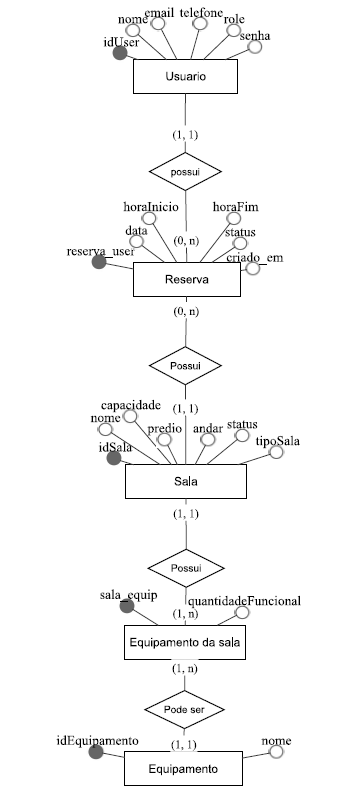

## Significado dos status de Reserva:

- Confirmada: a reserva está confirmada
- Cancelada: a reserva foi cancelada, mas fica no histórico
- Pendente: a reserva não pôde ser confirmada na hora de criação por determinado motivo

## Significado dos status de Sala:

- Disponivel: a sala pode ser reservada
- Indisponivel: a sala não pode ser reservada
- Manutencao: a sala não pode ser reservada
